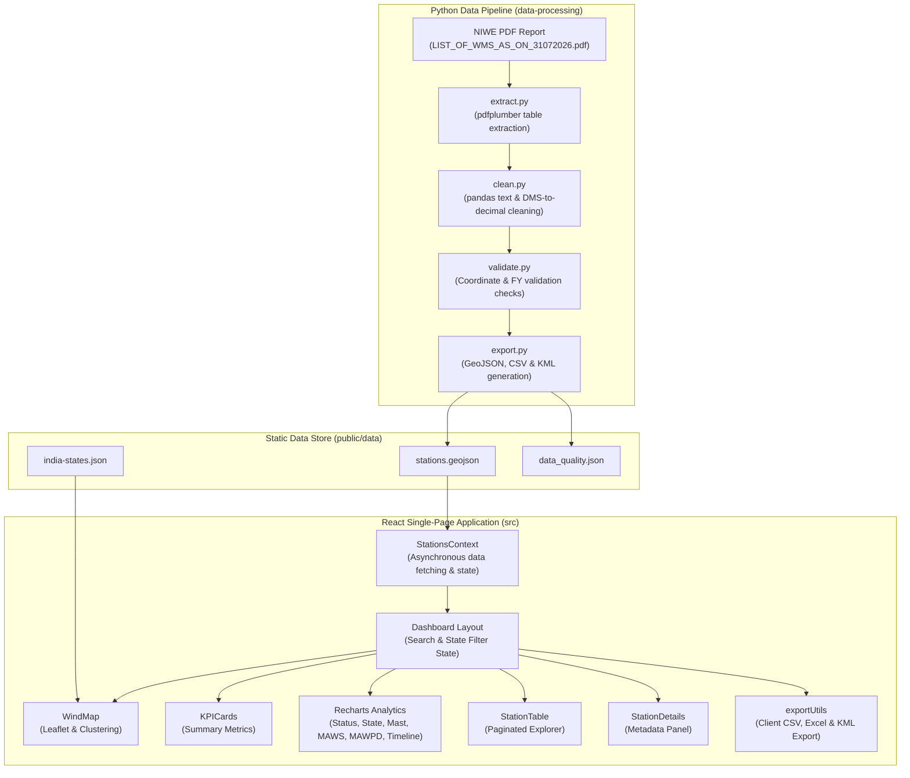

# NIWE Wind Stations

Interactive Wind Resource Monitoring and Analytics Platform for NIWE Measurement Stations Across India

[](https://react.dev/)
[](https://www.typescriptlang.org/)
[](https://vitejs.dev/)
[](https://leafletjs.com/)
[](https://www.python.org/)

---

## Overview

NIWE Wind Stations is a web-based single-page application (SPA) engineered to visualize, analyze, and query wind measurement station datasets across India, maintained by the National Institute of Wind Energy (NIWE), Ministry of New and Renewable Energy (MNRE).

### Problem Addressed
Official NIWE wind resource data is originally published in static PDF reports (`LIST_OF_WMS_AS_ON_31072026.pdf`), making spatial querying, regional comparison, and historical trend analysis cumbersome.

### Purpose
This platform extracts and validates unstructured PDF tables into structured GeoJSON datasets, delivering an interactive geospatial map, state and search filters, analytical dashboards, a paginated station explorer table, and multi-format data export capabilities.

---

## Key Features

### Geospatial Map Visualization
- Leaflet-powered interactive map rendering all wind measurement stations across India.
- Color-coded status markers indicating operational state: Green (In Operation) and Red (Closed).
- Marker clustering via `react-leaflet-cluster` to optimize performance across dense station clusters.
- Indian state boundary polygon overlays (`india-states.json`) with hover highlight interactions.
- Dual basemap selection switching between Street Map (OpenStreetMap) and Satellite Imagery (Esri World Imagery).
- Interactive station tooltips on hover and click-triggered popups displaying station metadata.
- Integrated map controls including scale bar, status legend, and single-click camera reset to national view.

### Real-Time Search and Multi-Level Filtering
- Dynamic filtering by state through a dropdown selector.
- Search input matching station name, district, or state text.
- One-click filter reset restoring default geographic scale and marker visibility.

### Summary Metrics and Analytics Dashboard
- Key performance indicator (KPI) cards displaying Total Stations, Operational Stations, Closed Stations, and Total States/Areas covered.
- Operational status breakdown chart (`StatusChart.tsx`).
- State-wise station distribution statistics chart (`StateStatistics.tsx`).
- Mast height distribution chart (`MastHeightChart.tsx`).
- Mean Annual Wind Speed (MAWS in m/s) state average chart (`WindSpeedChart.tsx`).
- Mean Annual Wind Power Density (MAWPD in W/m²) state average chart (`PowerDensityChart.tsx`).
- Historical station installation timeline tracking annual commissioning trends (`InstallationTimeline.tsx`).

### Station Explorer Table and Detail Inspector
- Paginated station table presenting 20 records per page.
- Complete metric reporting including station name, state, district, status, mast height, elevation, wind speed, power density, and coordinates.
- Accessible keyboard navigation and row selection that auto-scrolls to and focuses the selected station on the map.
- Dedicated station details drawer (`StationDetails.tsx`) displaying comprehensive technical specifications.

### Multi-Format Data Export
- Client-side dataset export supporting CSV (`stations_filtered.csv`), Excel (`stations_filtered.xlsx` via dynamic module import), and KML (`stations_filtered.kml` for GIS/Google Earth integration).

### Python ETL and Data Validation Pipeline
- Automated PDF extraction using `pdfplumber`.
- Data cleaning pipeline converting DMS (Degrees-Minutes-Seconds) coordinates into decimal degrees and standardizing regional nomenclature.
- Automated data quality checks validating geographic bounding boxes (6°-38°N, 68°-98°E), mast heights (10–150m), financial year alignments, duplicate records, and spatial distance median outliers.
- Data quality telemetry generation (`data_quality.json`) and automated sync to static public directories.

---

## Application / Data Flow

The platform operates on a two-tier architecture: an offline Python ETL pipeline that processes raw PDF documents into validated GeoJSON data, and a client-side React SPA that ingests and visualizes the dataset.



---

## Technology Stack

| Category | Technology | Purpose |
|---|---|---|
| **Frontend Framework** | React 19 | Component-based UI architecture |
| **Language** | TypeScript 6 / JavaScript ES6+ | Type-safe application logic |
| **Build System** | Vite 8 | Development server and module bundling |
| **Geospatial Mapping** | Leaflet 1.9, react-leaflet 5, react-leaflet-cluster 4 | Map rendering, spatial layers, marker clustering |
| **Data Visualization** | Recharts 3 | Interactive charts and analytics graphs |
| **Client Export** | SheetJS (xlsx), Blob API | Dynamic CSV, Excel, and KML generation |
| **Styling** | Vanilla CSS | CSS custom properties design system |
| **PDF Extraction** | pdfplumber | Extraction of tabular data from PDF files |
| **Data Processing** | Python 3, pandas, openpyxl | Data transformation, coordinate conversion, validation |
| **Testing** | pytest | Data validation suite testing |

---

## Project Structure

```text
niwe-wind-stations/
├── data-processing/
│   ├── data/
│   │   ├── processed/
│   │   │   ├── data_quality.json
│   │   │   ├── raw_tables.csv
│   │   │   ├── raw_text.txt
│   │   │   ├── review_required.csv
│   │   │   ├── stations.csv
│   │   │   ├── stations.geojson
│   │   │   ├── stations.kml
│   │   │   ├── stations.kmz
│   │   │   ├── stations_cleaned.csv
│   │   │   └── stations_validated.csv
│   │   └── raw/
│   │       └── LIST_OF_WMS_AS_ON_31072026.pdf
│   ├── scripts/
│   │   ├── clean.py
│   │   ├── export.py
│   │   ├── extract.py
│   │   └── validate.py
│   ├── tests/
│   │   └── test_validation.py
│   └── requirements.txt
├── public/
│   ├── data/
│   │   ├── data_quality.json
│   │   ├── india-states.json
│   │   ├── stations.csv
│   │   └── stations.geojson
│   ├── favicon.svg
│   └── icons.svg
├── src/
│   ├── assets/
│   │   ├── hero.png
│   │   ├── react.svg
│   │   └── vite.svg
│   ├── components/
│   │   ├── dashboard/
│   │   │   ├── Dashboard.tsx
│   │   │   ├── InstallationTimeline.tsx
│   │   │   ├── KPICards.tsx
│   │   │   ├── MastHeightChart.tsx
│   │   │   ├── PowerDensityChart.tsx
│   │   │   ├── StateStatistics.tsx
│   │   │   ├── StationDetails.tsx
│   │   │   ├── StationTable.tsx
│   │   │   ├── StatusChart.tsx
│   │   │   └── WindSpeedChart.tsx
│   │   └── map/
│   │       └── WindMap.jsx
│   ├── context/
│   │   └── StationsContext.tsx
│   ├── types/
│   │   └── station.ts
│   ├── utils/
│   │   ├── analyticsUtils.ts
│   │   └── exportUtils.js
│   ├── App.css
│   ├── App.tsx
│   ├── index.css
│   └── main.tsx
├── .gitignore
├── eslint.config.js
├── index.html
├── package.json
├── package-lock.json
├── README.md
├── tsconfig.app.json
├── tsconfig.json
├── tsconfig.node.json
└── vite.config.ts
```

---

## Getting Started

### Prerequisites
- Node.js 18+
- npm 9+
- Python 3.10+ (required only for running the data processing pipeline)

### Frontend Installation and Development

```bash
git clone https://github.com/SHREYA-G-AMIN/niwe-wind-stations.git
cd niwe-wind-stations
```

### 2. Install dependencies

```bash
npm install

# Start local development server
npm run dev
```

### Production Build and Preview

```bash
npm run build

# Preview production build locally
npm run preview

# Run ESLint check
npm run lint
```

### Data Processing Pipeline Setup

To re-process or update the NIWE station dataset from raw PDF files:

```bash
# Navigate to data processing directory
cd data-processing

# Install Python dependencies
pip install -r requirements.txt

# Step 1: Extract tables from raw PDF
python scripts/extract.py

# Step 2: Clean text and convert DMS coordinates
python scripts/clean.py

# Step 3: Run data validation checks
python scripts/validate.py

# Step 4: Export GeoJSON, CSV, and KML to static asset directories
python scripts/export.py

# Step 5: Execute pipeline tests
pytest
```

---

## Team & Contributions

| Contributor | GitHub | Contribution |
|---|---|---|
| Shreya G Amin | [SHREYA-G-AMIN](https://github.com/SHREYA-G-AMIN) | Map & Visualization |
| Moulya Hegde | [moulya-hegde](https://github.com/moulya-hegde) | Search & Filtering |
| Manish D Rao | [Manish-D-Rao](https://github.com/Manish-D-Rao) | Dashboard & Analytics |
| Manya Jain | [Manya-Jain-66](https://github.com/Manya-Jain-66) | Station Explorer |
| Ishta P Jain | [Ishta-P-Jain](https://github.com/Ishta-P-Jain) | Data Processing & Export |

---

## Repository

Repository Link: [https://github.com/SHREYA-G-AMIN/niwe-wind-stations](https://github.com/SHREYA-G-AMIN/niwe-wind-stations)
